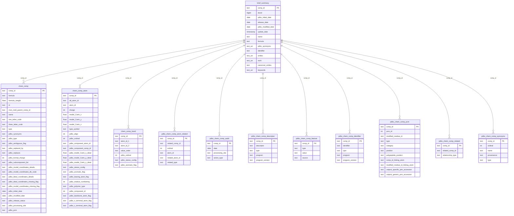

# cc ER Diagram

- **Primary Key**: `comp_id`
- **Tables**: 12

```mermaid
erDiagram
    brief_summary ||--o{ chem_comp : "comp_id"
    brief_summary ||--o{ chem_comp_atom : "comp_id"
    brief_summary ||--o{ chem_comp_bond : "comp_id"
    brief_summary ||--o{ pdbx_chem_comp_atom_related : "comp_id"
    brief_summary ||--o{ pdbx_chem_comp_audit : "comp_id"
    brief_summary ||--o{ pdbx_chem_comp_descriptor : "comp_id"
    brief_summary ||--o{ pdbx_chem_comp_feature : "comp_id"
    brief_summary ||--o{ pdbx_chem_comp_identifier : "comp_id"
    brief_summary ||--o{ pdbx_chem_comp_pcm : "comp_id"
    brief_summary ||--o{ pdbx_chem_comp_related : "comp_id"
    brief_summary ||--o{ pdbx_chem_comp_synonyms : "comp_id"
    brief_summary {
        text comp_id PK
        bigint docid
        date pdbx_initial_date
        date release_date
        date pdbx_modified_date
        timestamp update_date
        text name
        text formula
        text_arr pdbx_synonyms
        text identifier
        text_arr smiles
        text_arr inchi
        text canonical_smiles
        text_arr keywords
    }
    chem_comp {
        text comp_id PK
        text formula
        float formula_weight
        text id
        text mon_nstd_parent_comp_id
        text name
        text one_letter_code
        text three_letter_code
        text type
        text pdbx_synonyms
        text pdbx_type
        text pdbx_ambiguous_flag
        text pdbx_replaced_by
        text pdbx_replaces
        int pdbx_formal_charge
        text pdbx_subcomponent_list
        text pdbx_model_coordinates_details
        text pdbx_model_coordinates_db_code
        text pdbx_ideal_coordinates_details
        text pdbx_ideal_coordinates_missing_flag
        text pdbx_model_coordinates_missing_flag
        date pdbx_initial_date
        date pdbx_modified_date
        text pdbx_release_status
        text pdbx_processing_site
        text pdbx_pcm
    }
    chem_comp_atom {
        text comp_id PK
        text alt_atom_id
        text atom_id
        int charge
        float model_Cartn_x
        float model_Cartn_y
        float model_Cartn_z
        text type_symbol
        int pdbx_align
        int pdbx_ordinal
        text pdbx_component_atom_id
        text pdbx_component_comp_id
        float pdbx_model_Cartn_x_ideal
        float pdbx_model_Cartn_y_ideal
        float pdbx_model_Cartn_z_ideal
        text pdbx_stereo_config
        text pdbx_aromatic_flag
        text pdbx_leaving_atom_flag
        int pdbx_residue_numbering
        text pdbx_polymer_type
        int pdbx_component_id
        text pdbx_backbone_atom_flag
        text pdbx_n_terminal_atom_flag
        text pdbx_c_terminal_atom_flag
    }
    chem_comp_bond {
        text comp_id PK
        text atom_id_1
        text atom_id_2
        text value_order
        int pdbx_ordinal
        text pdbx_stereo_config
        text pdbx_aromatic_flag
    }
    pdbx_chem_comp_atom_related {
        text comp_id PK
        text related_comp_id
        int ordinal
        text atom_id
        text related_atom_id
        text related_type
    }
    pdbx_chem_comp_audit {
        text comp_id PK
        date date
        text processing_site
        text action_type
    }
    pdbx_chem_comp_descriptor {
        text comp_id PK
        text descriptor
        text type
        text program
        text program_version
    }
    pdbx_chem_comp_feature {
        text comp_id PK
        text type
        text value
        text source
    }
    pdbx_chem_comp_identifier {
        text comp_id PK
        text identifier
        text type
        text program
        text program_version
    }
    pdbx_chem_comp_pcm {
        text comp_id PK
        int pcm_id
        text modified_residue_id
        text type
        text category
        text position
        text polypeptide_position
        text comp_id_linking_atom
        text modified_residue_id_linking_atom
        text uniprot_specific_ptm_accession
        text uniprot_generic_ptm_accession
    }
    pdbx_chem_comp_related {
        text comp_id PK
        text related_comp_id
        text relationship_type
    }
    pdbx_chem_comp_synonyms {
        text comp_id PK
        int ordinal
        text name
        text provenance
        text type
    }
```
