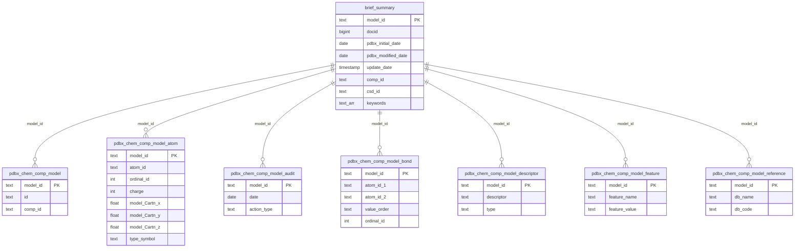

# ccmodel ER Diagram

- **Primary Key**: `model_id`
- **Tables**: 8

```mermaid
erDiagram
    brief_summary ||--o{ pdbx_chem_comp_model : "model_id"
    brief_summary ||--o{ pdbx_chem_comp_model_atom : "model_id"
    brief_summary ||--o{ pdbx_chem_comp_model_audit : "model_id"
    brief_summary ||--o{ pdbx_chem_comp_model_bond : "model_id"
    brief_summary ||--o{ pdbx_chem_comp_model_descriptor : "model_id"
    brief_summary ||--o{ pdbx_chem_comp_model_feature : "model_id"
    brief_summary ||--o{ pdbx_chem_comp_model_reference : "model_id"
    brief_summary {
        text model_id PK
        bigint docid
        date pdbx_initial_date
        date pdbx_modified_date
        timestamp update_date
        text comp_id
        text csd_id
        text_arr keywords
    }
    pdbx_chem_comp_model {
        text model_id PK
        text id
        text comp_id
    }
    pdbx_chem_comp_model_atom {
        text model_id PK
        text atom_id
        int ordinal_id
        int charge
        float model_Cartn_x
        float model_Cartn_y
        float model_Cartn_z
        text type_symbol
    }
    pdbx_chem_comp_model_audit {
        text model_id PK
        date date
        text action_type
    }
    pdbx_chem_comp_model_bond {
        text model_id PK
        text atom_id_1
        text atom_id_2
        text value_order
        int ordinal_id
    }
    pdbx_chem_comp_model_descriptor {
        text model_id PK
        text descriptor
        text type
    }
    pdbx_chem_comp_model_feature {
        text model_id PK
        text feature_name
        text feature_value
    }
    pdbx_chem_comp_model_reference {
        text model_id PK
        text db_name
        text db_code
    }
```
