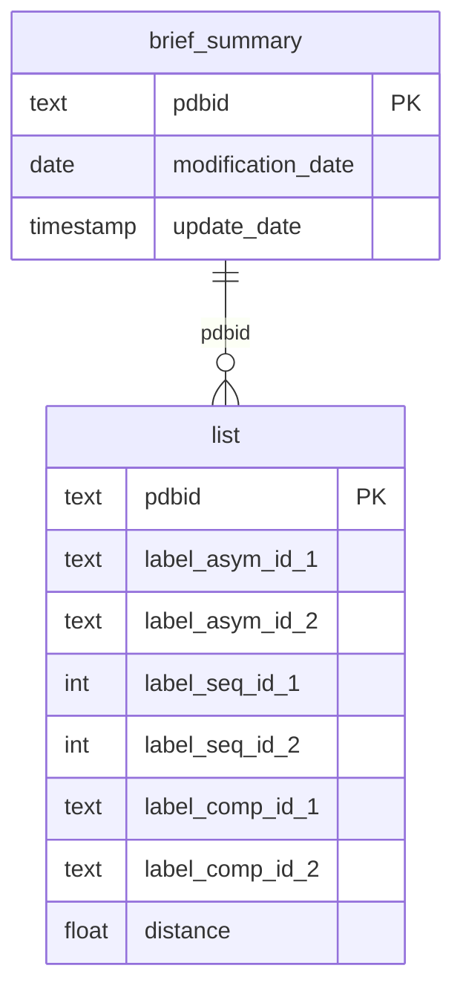

# contacts ER Diagram

- **Primary Key**: `pdbid`
- **Tables**: 2

```mermaid
erDiagram
    brief_summary ||--o{ list : "pdbid"
    brief_summary {
        text pdbid PK
        date modification_date
        timestamp update_date
    }
    list {
        text pdbid PK
        text label_asym_id_1
        text label_asym_id_2
        int label_seq_id_1
        int label_seq_id_2
        text label_comp_id_1
        text label_comp_id_2
        float distance
    }
```
