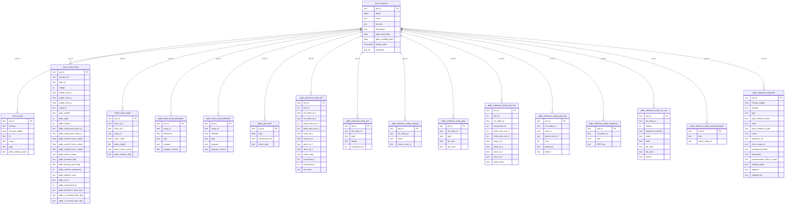

# prd ER Diagram

- **Primary Key**: `prd_id`
- **Tables**: 17

```mermaid
erDiagram
    brief_summary ||--o{ chem_comp : "prd_id"
    brief_summary ||--o{ chem_comp_atom : "prd_id"
    brief_summary ||--o{ chem_comp_bond : "prd_id"
    brief_summary ||--o{ pdbx_chem_comp_descriptor : "prd_id"
    brief_summary ||--o{ pdbx_chem_comp_identifier : "prd_id"
    brief_summary ||--o{ pdbx_prd_audit : "prd_id"
    brief_summary ||--o{ pdbx_reference_entity_link : "prd_id"
    brief_summary ||--o{ pdbx_reference_entity_list : "prd_id"
    brief_summary ||--o{ pdbx_reference_entity_nonpoly : "prd_id"
    brief_summary ||--o{ pdbx_reference_entity_poly : "prd_id"
    brief_summary ||--o{ pdbx_reference_entity_poly_link : "prd_id"
    brief_summary ||--o{ pdbx_reference_entity_poly_seq : "prd_id"
    brief_summary ||--o{ pdbx_reference_entity_sequence : "prd_id"
    brief_summary ||--o{ pdbx_reference_entity_src_nat : "prd_id"
    brief_summary ||--o{ pdbx_reference_entity_subcomponents : "prd_id"
    brief_summary ||--o{ pdbx_reference_molecule : "prd_id"
    brief_summary {
        text prd_id PK
        bigint docid
        text name
        text formula
        text description
        date pdbx_initial_date
        date pdbx_modified_date
        timestamp update_date
        text_arr keywords
    }
    chem_comp {
        text prd_id PK
        text formula
        float formula_weight
        text id
        text name
        text type
        text pdbx_release_status
    }
    chem_comp_atom {
        text prd_id PK
        text alt_atom_id
        text atom_id
        int charge
        float model_Cartn_x
        float model_Cartn_y
        float model_Cartn_z
        text comp_id
        text type_symbol
        int pdbx_align
        int pdbx_ordinal
        text pdbx_component_atom_id
        text pdbx_component_comp_id
        float pdbx_model_Cartn_x_ideal
        float pdbx_model_Cartn_y_ideal
        float pdbx_model_Cartn_z_ideal
        text pdbx_stereo_config
        text pdbx_aromatic_flag
        text pdbx_leaving_atom_flag
        int pdbx_residue_numbering
        text pdbx_polymer_type
        text pdbx_ref_id
        int pdbx_component_id
        text pdbx_backbone_atom_flag
        text pdbx_n_terminal_atom_flag
        text pdbx_c_terminal_atom_flag
    }
    chem_comp_bond {
        text prd_id PK
        text atom_id_1
        text atom_id_2
        text comp_id
        text value_order
        int pdbx_ordinal
        text pdbx_stereo_config
        text pdbx_aromatic_flag
    }
    pdbx_chem_comp_descriptor {
        text prd_id PK
        text comp_id
        text descriptor
        text type
        text program
        text program_version
    }
    pdbx_chem_comp_identifier {
        text prd_id PK
        text comp_id
        text identifier
        text type
        text program
        text program_version
    }
    pdbx_prd_audit {
        text prd_id PK
        date date
        text processing_site
        text action_type
    }
    pdbx_reference_entity_link {
        text prd_id PK
        int link_id
        text ref_entity_id_1
        text ref_entity_id_2
        int entity_seq_num_1
        int entity_seq_num_2
        text comp_id_1
        text comp_id_2
        text atom_id_1
        text atom_id_2
        text value_order
        int component_1
        int component_2
        text link_class
    }
    pdbx_reference_entity_list {
        text prd_id PK
        text ref_entity_id
        text type
        text details
        int component_id
    }
    pdbx_reference_entity_nonpoly {
        text prd_id PK
        text ref_entity_id
        text name
        text chem_comp_id
    }
    pdbx_reference_entity_poly {
        text prd_id PK
        text ref_entity_id
        text type
        text db_code
        text db_name
    }
    pdbx_reference_entity_poly_link {
        text prd_id PK
        int link_id
        text ref_entity_id
        int component_id
        int entity_seq_num_1
        int entity_seq_num_2
        text comp_id_1
        text comp_id_2
        text atom_id_1
        text atom_id_2
        text value_order
    }
    pdbx_reference_entity_poly_seq {
        text prd_id PK
        text ref_entity_id
        text mon_id
        text parent_mon_id
        int num
        text observed
        text hetero
    }
    pdbx_reference_entity_sequence {
        text prd_id PK
        text ref_entity_id
        text type
        text NRP_flag
    }
    pdbx_reference_entity_src_nat {
        text prd_id PK
        text ref_entity_id
        int ordinal
        text organism_scientific
        text strain
        text taxid
        text db_code
        text db_name
        text source
    }
    pdbx_reference_entity_subcomponents {
        text prd_id PK
        text seq
        text chem_comp_id
    }
    pdbx_reference_molecule {
        text prd_id PK
        float formula_weight
        text formula
        text type
        text type_evidence_code
        text class
        text class_evidence_code
        text name
        text represent_as
        text chem_comp_id
        text compound_details
        text description
        text representative_PDB_id_code
        text release_status
        text replaces
        text replaced_by
    }
```
