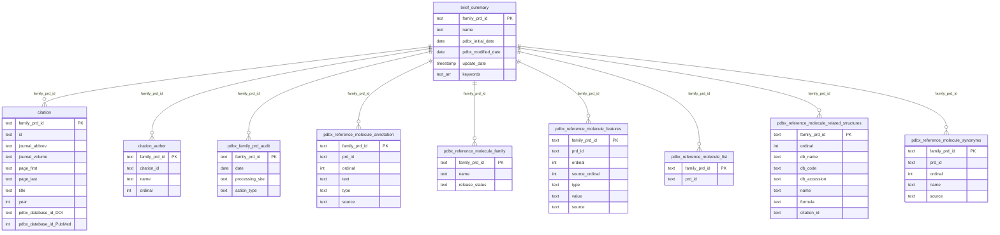

# prd_family ER Diagram

- **Primary Key**: `family_prd_id`
- **Tables**: 10

```mermaid
erDiagram
    brief_summary ||--o{ citation : "family_prd_id"
    brief_summary ||--o{ citation_author : "family_prd_id"
    brief_summary ||--o{ pdbx_family_prd_audit : "family_prd_id"
    brief_summary ||--o{ pdbx_reference_molecule_annotation : "family_prd_id"
    brief_summary ||--o{ pdbx_reference_molecule_family : "family_prd_id"
    brief_summary ||--o{ pdbx_reference_molecule_features : "family_prd_id"
    brief_summary ||--o{ pdbx_reference_molecule_list : "family_prd_id"
    brief_summary ||--o{ pdbx_reference_molecule_related_structures : "family_prd_id"
    brief_summary ||--o{ pdbx_reference_molecule_synonyms : "family_prd_id"
    brief_summary {
        text family_prd_id PK
        text name
        date pdbx_initial_date
        date pdbx_modified_date
        timestamp update_date
        text_arr keywords
    }
    citation {
        text family_prd_id PK
        text id
        text journal_abbrev
        text journal_volume
        text page_first
        text page_last
        text title
        int year
        text pdbx_database_id_DOI
        int pdbx_database_id_PubMed
    }
    citation_author {
        text family_prd_id PK
        text citation_id
        text name
        int ordinal
    }
    pdbx_family_prd_audit {
        text family_prd_id PK
        date date
        text processing_site
        text action_type
    }
    pdbx_reference_molecule_annotation {
        text family_prd_id PK
        text prd_id
        int ordinal
        text text
        text type
        text source
    }
    pdbx_reference_molecule_family {
        text family_prd_id PK
        text name
        text release_status
    }
    pdbx_reference_molecule_features {
        text family_prd_id PK
        text prd_id
        int ordinal
        int source_ordinal
        text type
        text value
        text source
    }
    pdbx_reference_molecule_list {
        text family_prd_id PK
        text prd_id
    }
    pdbx_reference_molecule_related_structures {
        text family_prd_id PK
        int ordinal
        text db_name
        text db_code
        text db_accession
        text name
        text formula
        text citation_id
    }
    pdbx_reference_molecule_synonyms {
        text family_prd_id PK
        text prd_id
        int ordinal
        text name
        text source
    }
```
